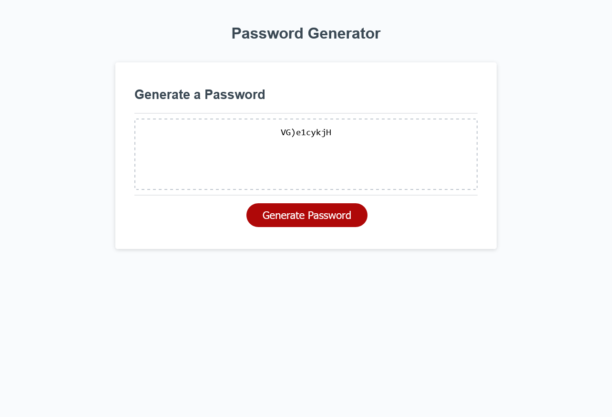

# Module 3 Challenge

## Table of Contents

- [Overview](#overview)
  - [The challenge](#the-challenge)
  - [User Story](#user-story)
  - [Acceptance Criteria](#acceptance-criteria)
  - [Screenshot](#screenshot)
  - [Links](#links)
- [My process](#my-process)
  - [Built with](#built-with)
  - [What I learned](#what-i-learned)
  - [Continued development](#continued-development)
  - [Useful resources](#useful-resources)
- [Author](#author)
- [Acknowledgments](#acknowledgments)
  ​

## Overview

This weeks challenge was to use the given code and create a password generator
​

### The challenge

​Create a password generator using javascript, based on the users input of what characters they want in the password.

### User Story

```
AS AN employee with access to sensitive data
I WANT to randomly generate a password that meets certain criteria
SO THAT I can create a strong password that provides greater security
```

### Acceptance Criteria

```
GIVEN I need a new, secure password
WHEN I click the button to generate a password
THEN I am presented with a series of prompts for password criteria
WHEN prompted for password criteria
THEN I select which criteria to include in the password
WHEN prompted for the length of the password
THEN I choose a length of at least 8 characters and no more than 128 characters
WHEN asked for character types to include in the password
THEN I confirm whether or not to include lowercase, uppercase, numeric, and/or special characters
WHEN I answer each prompt
THEN my input should be validated and at least one character type should be selected
WHEN all prompts are answered
THEN a password is generated that matches the selected criteria
WHEN the password is generated
THEN the password is either displayed in an alert or written to the page
```

​

### Screenshot



### Links

​

- Solution URL: [Solution](https://github.com/lafflin/03-Javascript-Password-Generator)
- Live Site URL: [Site](https://lafflin.github.io/03-Javascript-Password-Generator/)
  ​

## My process

1. The first thing I did was I went to a study group session with our TA, Luigi, and he helped me to get my initial code set up.
2. Following this I spent many hours trying to get the code to work from there, but I could not for the life of my figure out how to get the password to generate. I then used askBCS and was able to get the code working better, but still not correctly.
3. After this I spent a while trying to get it working, leading up to the office hours on tuesday (5/17) where I spoke to another TA, Scott essentially told me I was over-complicating things as I was nearing 200 lines. He helped me find a much simpler way of setting up the code, but I was still getting an error with the password generation even though my array worked fine.
4. Finally, I used askBCS again to figure out the issue, which was that on line 123 I was multiplying math.random by charSet.passwordLength, not charSet.length. This small changed fixed the code entirely.

### Built with

- HTML
- CSS
- JavaScript

### What I learned

- For one, javascript is very difficult.
- How to use if, else, and for statements.

### Continued development

- I need to devote some more time to learning javascript
- I want to try and devote time to doing the 30 days of javascript challenge, just to try and hone my skills more.

### Useful resources

- AskBCS was invaluable for this project, as well as TA's
- StackOverflow was also helpful, albeit a bit less so

## Author

- Linkedin - [Max McLaughlin](https://www.linkedin.com/in/max-mcla/)

## Acknowledgments

- Luigi Campbell (TA), for helping me get started, helping me better understand how if statements work, and javascript syntax.
- Scott Nelson (TA), for helping me realize how much I was complicating the project and assisting me in majorly simplifying my code.
- AskBCS was hugely helpful for situation where StackOverflow and other resources were not able to help me figure out my issue.
